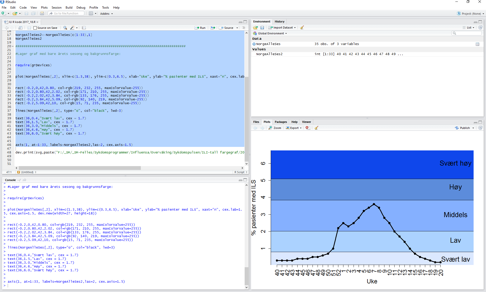

# What is R?

- A software for statistical analysis, data management and graphical presentation
- A programming language

# Why R?

- Free software
- Powerful and highly extensible
- Lots of people are using it, therefore loads of tutorials and help on google
- Can store your code for data analysis
    - Easy to re-use
    - Easy to re-produce work
    - Easy to check your work for errors
    
# Two possibilities for installing R

- RStudio
    - Development environment
    - Four-pane workspace

- R
    - Only one window
    - Less user friendly
    
# RStudio



Top left (Editor):

- Where you write R code

Bottom left (Console):

- Where the code is executed

Top right:

- List of objects currently in memory

Bottom right:

- Plot/graphs
- External packages
- Files in your working directory

# Shortcuts

- Tab:
    - Auto-complete function
    - Start typing in console and hit tab key, RStudio will suggest functions or file names.

- Ctrl+arrow up:
    - Finds the commands that you have run
    - NB! Only works in the Console area

- Control+enter/Control+R:
    - Takes the current line of code in the Editor, sends it to the Console and executes it. 
    
# Simple R Calculator

- Write the input (1+2) in the Editor (top left)
- Hit Control+Enter or Control+R
- See the answer in the Console (bottom left)

```{r}
1+2
```

# Variables

- Values can be assign to variables by using `=` or `<-`
- When assigning a value to a variable, no output is given. The value of the variable can be accessed by typing the variable name.

```{r}
x <- 10
x
```

# Vectors

The function c() is used to create vectors. Each element of a vector has to be of the same data type.

```{r}
x <- c(3,4,5,6)
x
```

If not using c(), it will only be a number, not a vector.

```{r}
x <- 3456
x
```

Elements in the vector can be accessed by using square brackets, `[]`

```{r}
x <- c(3,4,5,6)
x
x[1]
x[4]
```

Adding a number to a vector

```{r}
x <- c(3,4,5,6)
x + 1
```

Multiply two vectors (NOTE that these need to be the same length!)

```{r}
x <- c(3,4,5,6)
y <- c(1,1,2,2)
x*y
```

# Importing files

```{r eval=FALSE, include=TRUE}
xx <- read.table("F:/prosjekter/xx.txt", header=TRUE, na.string="", sep="\t", dec=",")
```

- `Header=TRUE` means that the first line is inluded as a header
- `Na.string=""` means
- `sep="\t"` means
- `dec=", "` means

You can also import different types of files, only change the .txt with other types eg .csv.

# Looking at the dataset

```{r}
d <- data.frame(x=c(1:50),y=c(6:55))
```

Skriv navnet på datasettet:

```{r}
d
```

If it is a large dataset, we can just look at the top of the dataset:

```{r}
head(d)
```

If it is a large dataset, we can just look at the bottom of the dataset:

```{r}
tail(d)
```

We can also just look at the first row and first column:

```{r}
d[1,1]
```

We can also just look at the first row:

```{r}
d[1,]
```

# Other notes

Legge til kommentarer:

- `#Kommentar`

Hjelp:

- `?hist`
- Google

Script (lage oppskrift):

- File/new script

Script (hente oppskrift):

- File/open script

# Laste inn pakker

- Packages/Install packages:
    - `install.packages("lubridate")`
    - `library(mem)`
    - `library(grDevices)`
    
# Lagre data

Tabeller:

`write.table(Influensa04y,"F:/_SM/_SM-Felles/Sykdomsprogrammer/Influensa/Overvåking/Sykdomspulsen/Gry R og MEM kurs/InfluensaConsAlly_20171010.txt", sep="\t")`

Grafer:

`dev.print(svg,"F:/_SM/_SM-Felles/Sykdomsprogrammer/Influensa/Overvåking/Sykdomspulsen/Gry R og MEM kurs/MEM_Alle_ar_2017_18ses_20171010.svg")`


